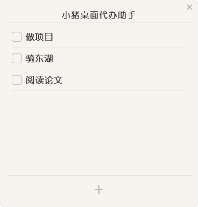
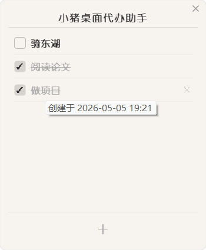

<h1>小猪桌面代办助手</h1>

极简风格悬浮桌面待办列表小组件，暖白半透明质感，高保真 UI 设计。无标题栏、菜单栏、状态栏，通过悬浮窗和快捷交互完成待办管理。

<table>
  <tr>
    <td></td>
    <td></td>
  </tr>
</table>

## 运行方式

### 方式一：直接运行（推荐）

前往 [Releases](https://github.com/zljcode/ZephyrTasks/releases) 页面下载最新版 `小猪桌面代办助手.exe`，双击即可运行，无需安装 Python 或任何依赖。

### 方式二：从源码运行

```bash
# 安装依赖
pip install PyQt5

# 运行
cd ZephyrTasks
python main.py
```

按 `Ctrl+C` 可在终端退出。

## 功能说明

| 操作 | 行为 |
|------|------|
| 鼠标点击复选框 | 切换任务完成/未完成状态 |
| 悬停任务行 | 显示创建时间（年月日 时:分） |
| 悬停任务行 + 点击 × | 删除任务 |
| 点击底部 "+" | 顶部出现输入框添加任务 |
| 输入框按回车 | 确认添加 |
| 输入框按 Esc | 取消添加 |
| 拖动窗口空白处 | 移动悬浮窗 |
| 拖拽边框 | 放大缩小窗口（字体跟随缩放） |
| 拖到屏幕左/上边缘 | 贴边隐藏，仅露出 4px 把手 |
| 鼠标碰触把手 | 窗口滑入显示 |
| 鼠标离开窗口 | 自动滑回隐藏 |
| 将窗口拖离边缘 | 保持常显 |
| 右上角 × | 关闭应用 |

## UI 特性

- 暖白半透明背景（#f8f5f1），圆角 10px，柔和阴影
- 字体：幼圆优先，加粗，可爱圆润风格
- 顶部标题"小猪桌面代办助手"
- 标题与列表、列表与加号按钮之间有分隔线
- 加号按钮加粗放大（32px）
- 关闭按钮 hover 时红色圆形底色 + 白色 X
- 窗口支持边框拖拽缩放，字体按比例自适应
- 关闭再打开恢复默认大小（280×380），位置持久化

## 数据存储

- 数据目录：`C:\Users\<用户名>\.ZephyrTasks\`
  - `tasks.db` — 任务数据（SQLite，含创建/完成时间）
  - `config.json` — 窗口位置

## 自行打包

详见 [PACKAGING.md](PACKAGING.md)。
